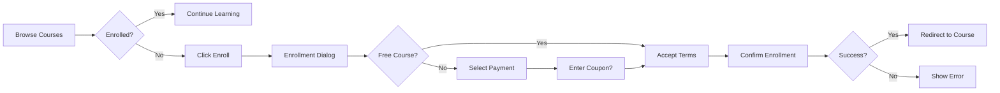

# Course Enrollment UI Implementation Plan

## Date: 2025-08-22
## Feature: Course Enrollment User Interface
## Priority: HIGH
## Architecture: Following Established Patterns

---

## 📋 Current State Analysis

### ✅ Already Implemented (Backend Ready):

#### 1. API Client (`/src/lib/api-client.ts`)
```typescript
async enrollInCourse(courseId: string, data?: { 
  paymentMethod?: string
  couponCode?: string 
}) {
  return this.post(`/api/v1/student/courses/${courseId}/enroll`, data)
}
```

#### 2. Service Layer (`/src/services/student-course-service.ts`)
```typescript
async enrollInCourse(
  userId: string,
  courseId: string,
  paymentData?: { paymentMethod?: string; couponCode?: string }
): Promise<ServiceResult<{ success: boolean; message: string; enrollmentId?: string }>>
```

#### 3. Store Actions (`/src/stores/slices/student-course-slice.ts`)
```typescript
enrollInCourse: async (userId: string, courseId: string, paymentData?: {...}) => {
  set({ enrollingCourseId: courseId, error: null })
  // Handles enrollment and refreshes courses
}
```

#### 4. Basic UI (`/src/app/course/[id]/page.tsx`)
- Simple enrollment button exists
- Uses `onClick={() => enrollInCourse('guest', courseId)}`
- No payment/coupon UI

### ❌ Missing Components:

1. **Enrollment Modal/Dialog**
   - Payment method selection
   - Coupon code input
   - Terms acceptance
   - Pricing display

2. **Enrollment States**
   - Already enrolled check
   - Enrollment in progress
   - Success confirmation
   - Error handling

3. **Course Card Enrollment**
   - Quick enroll from listing
   - Price display
   - Enrollment status badge

4. **Post-Enrollment Flow**
   - Success redirect
   - Welcome message
   - Start learning CTA

---

## 🏗️ Implementation Architecture

Following the established patterns from Course Sections and Media Assignment:

### Component Structure:
```
/src/components/
  /enrollment/
    EnrollmentDialog.tsx       # Main enrollment modal
    PaymentMethodSelector.tsx  # Payment options
    CouponInput.tsx           # Coupon code field
    EnrollmentSuccess.tsx     # Success message
    
/src/app/
  /course/[id]/
    page.tsx                  # Update enrollment button
  /courses/
    page.tsx                  # Add enrollment to cards
```

---

## 🛠️ Implementation Tasks

### Phase 1: Enrollment Dialog Component

#### Task 1.1: Create EnrollmentDialog Component
**File**: `/src/components/enrollment/EnrollmentDialog.tsx`

```typescript
interface EnrollmentDialogProps {
  course: Course
  isOpen: boolean
  onClose: () => void
  onSuccess: () => void
}

export function EnrollmentDialog({ course, isOpen, onClose, onSuccess }: EnrollmentDialogProps) {
  const [paymentMethod, setPaymentMethod] = useState<'free' | 'credit_card' | 'paypal'>('free')
  const [couponCode, setCouponCode] = useState('')
  const [termsAccepted, setTermsAccepted] = useState(false)
  
  const { enrollInCourse, enrollingCourseId } = useAppStore()
  const userId = useAuth() // Get from auth context
  
  const handleEnroll = async () => {
    if (!termsAccepted) {
      toast.error('Please accept the terms')
      return
    }
    
    await enrollInCourse(userId, course.id, {
      paymentMethod: course.price > 0 ? paymentMethod : undefined,
      couponCode: couponCode || undefined
    })
    
    onSuccess()
  }
  
  return (
    <Dialog open={isOpen} onOpenChange={onClose}>
      <DialogContent>
        <DialogHeader>
          <DialogTitle>Enroll in {course.title}</DialogTitle>
        </DialogHeader>
        
        {/* Price Display */}
        <div className="py-4">
          {course.price > 0 ? (
            <div className="text-2xl font-bold">${course.price}</div>
          ) : (
            <Badge variant="success">FREE</Badge>
          )}
        </div>
        
        {/* Payment Method (if paid) */}
        {course.price > 0 && (
          <PaymentMethodSelector 
            value={paymentMethod}
            onChange={setPaymentMethod}
          />
        )}
        
        {/* Coupon Code */}
        <CouponInput 
          value={couponCode}
          onChange={setCouponCode}
        />
        
        {/* Terms */}
        <Checkbox 
          checked={termsAccepted}
          onCheckedChange={setTermsAccepted}
        >
          I agree to the terms and conditions
        </Checkbox>
        
        {/* Actions */}
        <DialogFooter>
          <Button variant="outline" onClick={onClose}>
            Cancel
          </Button>
          <Button 
            onClick={handleEnroll}
            disabled={enrollingCourseId === course.id || !termsAccepted}
          >
            {enrollingCourseId === course.id ? (
              <LoadingSpinner size="sm" />
            ) : (
              'Enroll Now'
            )}
          </Button>
        </DialogFooter>
      </DialogContent>
    </Dialog>
  )
}
```

### Phase 2: Update Course Details Page

#### Task 2.1: Enhanced Enrollment Button
**File**: `/src/app/course/[id]/page.tsx`

```typescript
export default function CourseDetailsPage() {
  const [showEnrollDialog, setShowEnrollDialog] = useState(false)
  const { currentCourse, enrolledCourses } = useAppStore()
  
  const isEnrolled = enrolledCourses.some(c => c.id === currentCourse?.id)
  
  const handleEnrollSuccess = () => {
    setShowEnrollDialog(false)
    toast.success('Successfully enrolled!')
    router.push(`/student/course/${currentCourse.id}`)
  }
  
  return (
    <>
      {/* Enrollment Status/Button */}
      {isEnrolled ? (
        <Button asChild className="w-full" size="lg">
          <Link href={`/student/course/${currentCourse.id}`}>
            <Play className="mr-2 h-4 w-4" />
            Continue Learning
          </Link>
        </Button>
      ) : (
        <Button 
          className="w-full" 
          size="lg"
          onClick={() => setShowEnrollDialog(true)}
        >
          <ShoppingCart className="mr-2 h-4 w-4" />
          Enroll Now {currentCourse.price > 0 && `- $${currentCourse.price}`}
        </Button>
      )}
      
      {/* Enrollment Dialog */}
      <EnrollmentDialog
        course={currentCourse}
        isOpen={showEnrollDialog}
        onClose={() => setShowEnrollDialog(false)}
        onSuccess={handleEnrollSuccess}
      />
    </>
  )
}
```

### Phase 3: Update Course Cards

#### Task 3.1: Add Enrollment to Course Cards
**File**: `/src/components/course/ai-course-card.tsx`

```typescript
export function AICourseCard({ course }: { course: Course }) {
  const [showEnrollDialog, setShowEnrollDialog] = useState(false)
  const { enrolledCourses } = useAppStore()
  
  const isEnrolled = enrolledCourses.some(c => c.id === course.id)
  
  return (
    <Card>
      {/* ... existing card content ... */}
      
      <CardFooter className="flex justify-between">
        <div>
          {course.price > 0 ? (
            <span className="text-2xl font-bold">${course.price}</span>
          ) : (
            <Badge variant="success">FREE</Badge>
          )}
        </div>
        
        {isEnrolled ? (
          <Button asChild size="sm">
            <Link href={`/student/course/${course.id}`}>
              Continue
            </Link>
          </Button>
        ) : (
          <Button 
            size="sm"
            onClick={() => setShowEnrollDialog(true)}
          >
            Enroll
          </Button>
        )}
      </CardFooter>
      
      <EnrollmentDialog
        course={course}
        isOpen={showEnrollDialog}
        onClose={() => setShowEnrollDialog(false)}
        onSuccess={() => {
          setShowEnrollDialog(false)
          toast.success('Enrolled successfully!')
        }}
      />
    </Card>
  )
}
```

### Phase 4: Payment Integration (Future)

#### Task 4.1: Payment Method Selector
**File**: `/src/components/enrollment/PaymentMethodSelector.tsx`

```typescript
interface PaymentMethodSelectorProps {
  value: 'credit_card' | 'paypal' | 'stripe'
  onChange: (method: string) => void
}

export function PaymentMethodSelector({ value, onChange }: PaymentMethodSelectorProps) {
  return (
    <RadioGroup value={value} onValueChange={onChange}>
      <div className="space-y-2">
        <RadioGroupItem value="credit_card">
          <CreditCard className="mr-2 h-4 w-4" />
          Credit Card
        </RadioGroupItem>
        <RadioGroupItem value="paypal">
          <Wallet className="mr-2 h-4 w-4" />
          PayPal
        </RadioGroupItem>
        <RadioGroupItem value="stripe">
          <CreditCard className="mr-2 h-4 w-4" />
          Stripe
        </RadioGroupItem>
      </div>
    </RadioGroup>
  )
}
```

### Phase 5: Enrollment Status Management

#### Task 5.1: Check Enrollment Status
```typescript
// Add to store or service
async checkEnrollmentStatus(courseId: string): Promise<boolean> {
  const enrolledCourses = get().enrolledCourses
  return enrolledCourses.some(c => c.id === courseId)
}
```

#### Task 5.2: Handle Already Enrolled
```typescript
// In EnrollmentDialog
useEffect(() => {
  if (isEnrolled) {
    toast.info('You are already enrolled in this course')
    router.push(`/student/course/${course.id}`)
  }
}, [isEnrolled])
```

---

## 📊 UI/UX Flow

### Enrollment User Journey:



---

## 🎨 UI Components Needed

1. **EnrollmentDialog**
   - Modal with course info
   - Payment selection
   - Terms acceptance
   - Loading states

2. **EnrollmentButton**
   - Smart button component
   - Shows price if paid
   - Shows status if enrolled
   - Handles click to open dialog

3. **EnrollmentSuccess**
   - Success message
   - Next steps
   - Start learning CTA

4. **CouponInput**
   - Input with validation
   - Apply button
   - Success/error feedback

---

## ✅ Success Criteria

1. **Functional Requirements:**
   - [ ] User can enroll in free courses
   - [ ] User can enroll in paid courses (mock payment)
   - [ ] Coupon codes can be applied
   - [ ] Enrollment status is reflected immediately
   - [ ] Proper error handling for all scenarios

2. **UX Requirements:**
   - [ ] Clear pricing display
   - [ ] Smooth enrollment flow
   - [ ] Loading states during enrollment
   - [ ] Success feedback
   - [ ] Already enrolled prevention

3. **Technical Requirements:**
   - [ ] Uses existing backend APIs
   - [ ] Follows established patterns
   - [ ] Type-safe implementation
   - [ ] Optimistic UI updates
   - [ ] Error recovery

---

## 🔄 Implementation Phases

### Day 1: Core Components
- Create EnrollmentDialog
- Basic payment selector
- Terms checkbox

### Day 2: Integration
- Update course details page
- Update course cards
- Add enrollment status checks

### Day 3: Polish
- Add animations
- Error handling
- Success flows
- Loading states

### Day 4: Testing
- Test free enrollment
- Test paid enrollment
- Test coupon codes
- Test error scenarios

---

## 🚀 Future Enhancements

1. **Payment Integration**
   - Stripe integration
   - PayPal integration
   - Payment history

2. **Subscription Model**
   - Monthly/yearly plans
   - Bundle discounts
   - Student discounts

3. **Advanced Features**
   - Gift courses
   - Group enrollment
   - Corporate accounts
   - Referral system

---

## 📝 Notes

- Start with free course enrollment
- Mock payment for paid courses initially
- Focus on UX flow first
- Add payment providers later
- Ensure mobile responsiveness
- Consider accessibility (ARIA labels, keyboard navigation)