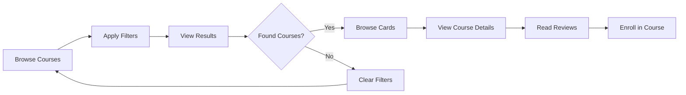

# Public Course API Integration Implementation Plan

## Date: 2025-08-22
## Feature: Public Course API Integration
## Priority: MEDIUM
## Architecture: Following Established Patterns

---

## 📋 Current State Analysis

### ✅ Already Implemented (Frontend Ready):

#### 1. **Public Course Pages**
- **`/courses`** - Course catalog with filtering and search
- **`/course/[id]`** - Course details with enrollment functionality
- **Course Cards** - AICourseCard with enrollment buttons
- **Enrollment System** - Complete enrollment flow with payment/coupon support

#### 2. **Existing Architecture**
```typescript
// API Client Structure
/src/lib/api-client.ts
- Basic structure exists
- Student course methods implemented
- Public course methods needed

// Service Layer
/src/services/
- student-course-service.ts ✅ (implemented)
- public-course-service.ts ❌ (missing)

// Store Management
/src/stores/slices/
- student-course-slice.ts ✅ (implemented)
- public-course-slice.ts ❌ (missing)

// UI Components
/src/components/course/
- ai-course-card.tsx ✅ (implemented)
- course-filters.tsx ❌ (missing)
- course-search.tsx ❌ (missing)
```

#### 3. **Available Backend APIs** (from Postman analysis)
```typescript
// Public Course Endpoints (No Auth Required)
GET /api/v1/courses
GET /api/v1/courses/{course_id}
GET /api/v1/courses/{course_id}/reviews

// Authenticated Endpoints
GET /api/v1/courses/recommended (requires auth)
```

### ❌ Missing Components:

1. **Public Course API Integration**
   - Public course service layer
   - Public course store slice
   - API client methods for public courses
   - Course filtering and search functionality

2. **Enhanced Course Catalog Features**
   - Advanced filtering (difficulty, category, price, rating)
   - Search functionality
   - Sorting options (popular, newest, price, rating)
   - Pagination support

3. **Course Reviews Integration**
   - Course reviews API integration
   - Reviews display component
   - Rating aggregation

4. **Recommended Courses**
   - Personalized recommendations API
   - Recommendation display components

---

## 🏗️ Implementation Architecture

Following the established patterns from Student Courses and Enrollment implementations:

### API Integration Layer:
```
/src/lib/
  api-client.ts              # Add public course methods
  
/src/services/
  public-course-service.ts   # New service for public course operations
  
/src/stores/slices/
  public-course-slice.ts     # New store slice for public course state
```

### UI Enhancement Layer:
```
/src/components/
  /course/
    course-filters.tsx       # Advanced filtering component
    course-search.tsx        # Search input component
    course-reviews.tsx       # Course reviews display
    recommended-courses.tsx  # Recommendations component
  
/src/app/
  /courses/
    page.tsx                 # Update with advanced filtering
  /course/[id]/
    page.tsx                 # Update with reviews integration
```

---

## 🛠️ Implementation Tasks

### Phase 1: API Client Integration

#### Task 1.1: Extend API Client
**File**: `/src/lib/api-client.ts`

```typescript
// Add to existing ApiClient class
class ApiClient {
  // ... existing methods ...

  // Public Course Methods (No Auth Required)
  async getPublicCourses(params?: {
    search?: string
    difficulty?: 'all' | 'beginner' | 'intermediate' | 'advanced'
    category?: string
    priceRange?: 'all' | 'free' | 'paid'
    minRating?: number
    instructor?: string
    sortBy?: 'popular' | 'newest' | 'price-asc' | 'price-desc' | 'rating'
    page?: number
    limit?: number
  }) {
    const queryParams = new URLSearchParams()
    if (params) {
      Object.entries(params).forEach(([key, value]) => {
        if (value !== undefined && value !== null && value !== '') {
          queryParams.append(key, value.toString())
        }
      })
    }
    
    const url = `/api/v1/courses${queryParams.toString() ? `?${queryParams.toString()}` : ''}`
    return this.get(url)
  }

  async getPublicCourseById(courseId: string) {
    return this.get(`/api/v1/courses/${courseId}`)
  }

  async getCourseReviews(courseId: string, params?: {
    page?: number
    limit?: number
  }) {
    const queryParams = new URLSearchParams()
    if (params) {
      Object.entries(params).forEach(([key, value]) => {
        if (value !== undefined) {
          queryParams.append(key, value.toString())
        }
      })
    }
    
    const url = `/api/v1/courses/${courseId}/reviews${queryParams.toString() ? `?${queryParams.toString()}` : ''}`
    return this.get(url)
  }

  // Authenticated Methods
  async getRecommendedCourses() {
    return this.get('/api/v1/courses/recommended', { credentials: 'include' })
  }
}
```

#### Task 1.2: Create Public Course Service
**File**: `/src/services/public-course-service.ts`

```typescript
import { apiClient } from '@/lib/api-client'
import { Course, CourseReview } from '@/types/domain'
import { ServiceResult } from '@/utils/error-handler'

export interface CourseFilters {
  search?: string
  difficulty?: 'all' | 'beginner' | 'intermediate' | 'advanced'
  category?: string
  priceRange?: 'all' | 'free' | 'paid'
  minRating?: number
  instructor?: string
  sortBy?: 'popular' | 'newest' | 'price-asc' | 'price-desc' | 'rating'
  page?: number
  limit?: number
}

export interface CourseCatalogResponse {
  courses: Course[]
  totalCount: number
  totalPages: number
  currentPage: number
  hasNextPage: boolean
  hasPreviousPage: boolean
}

export interface CourseReviewsResponse {
  reviews: CourseReview[]
  totalCount: number
  averageRating: number
  ratingDistribution: Record<number, number>
  currentPage: number
  totalPages: number
}

class PublicCourseService {
  async getCourses(filters?: CourseFilters): Promise<ServiceResult<CourseCatalogResponse>> {
    try {
      console.log('🔍 Fetching public courses with filters:', filters)
      
      const response = await apiClient.getPublicCourses(filters)
      
      if (response.success && response.data) {
        return {
          success: true,
          data: response.data
        }
      }
      
      return {
        success: false,
        error: 'Failed to fetch courses'
      }
    } catch (error) {
      console.error('❌ Error fetching public courses:', error)
      return {
        success: false,
        error: 'Network error while fetching courses'
      }
    }
  }

  async getCourseById(courseId: string): Promise<ServiceResult<Course>> {
    try {
      console.log('🔍 Fetching course details for:', courseId)
      
      const response = await apiClient.getPublicCourseById(courseId)
      
      if (response.success && response.data) {
        return {
          success: true,
          data: response.data
        }
      }
      
      return {
        success: false,
        error: 'Course not found'
      }
    } catch (error) {
      console.error('❌ Error fetching course details:', error)
      return {
        success: false,
        error: 'Network error while fetching course details'
      }
    }
  }

  async getCourseReviews(
    courseId: string, 
    page: number = 1, 
    limit: number = 20
  ): Promise<ServiceResult<CourseReviewsResponse>> {
    try {
      console.log('🔍 Fetching course reviews for:', courseId)
      
      const response = await apiClient.getCourseReviews(courseId, { page, limit })
      
      if (response.success && response.data) {
        return {
          success: true,
          data: response.data
        }
      }
      
      return {
        success: false,
        error: 'Failed to fetch reviews'
      }
    } catch (error) {
      console.error('❌ Error fetching course reviews:', error)
      return {
        success: false,
        error: 'Network error while fetching reviews'
      }
    }
  }

  async getRecommendedCourses(): Promise<ServiceResult<Course[]>> {
    try {
      console.log('🔍 Fetching recommended courses')
      
      const response = await apiClient.getRecommendedCourses()
      
      if (response.success && response.data) {
        return {
          success: true,
          data: response.data.courses || []
        }
      }
      
      return {
        success: false,
        error: 'Failed to fetch recommendations'
      }
    } catch (error) {
      console.error('❌ Error fetching recommended courses:', error)
      return {
        success: false,
        error: 'Network error while fetching recommendations'
      }
    }
  }
}

export const publicCourseService = new PublicCourseService()
```

### Phase 2: Store Management

#### Task 2.1: Create Public Course Store Slice
**File**: `/src/stores/slices/public-course-slice.ts`

```typescript
import { StateCreator } from 'zustand'
import { Course, CourseReview } from '@/types/domain'
import { publicCourseService, CourseFilters, CourseCatalogResponse, CourseReviewsResponse } from '@/services/public-course-service'

export interface PublicCourseSlice {
  // State
  courses: Course[]
  currentCourse: Course | null
  courseReviews: CourseReview[]
  recommendedCourses: Course[]
  
  // Pagination & Filters
  currentFilters: CourseFilters
  totalPages: number
  currentPage: number
  totalCount: number
  hasNextPage: boolean
  hasPreviousPage: boolean
  
  // Loading States
  loading: boolean
  loadingCourse: boolean
  loadingReviews: boolean
  loadingRecommendations: boolean
  
  // Error States
  error: string | null
  courseError: string | null
  reviewsError: string | null
  
  // Actions
  loadCourses: (filters?: CourseFilters) => Promise<void>
  loadCourseById: (courseId: string) => Promise<void>
  loadCourseReviews: (courseId: string, page?: number) => Promise<void>
  loadRecommendedCourses: () => Promise<void>
  updateFilters: (filters: Partial<CourseFilters>) => void
  clearCurrentCourse: () => void
  clearError: () => void
}

export const createPublicCourseSlice: StateCreator<
  PublicCourseSlice,
  [],
  [],
  PublicCourseSlice
> = (set, get) => ({
  // Initial State
  courses: [],
  currentCourse: null,
  courseReviews: [],
  recommendedCourses: [],
  
  currentFilters: {
    page: 1,
    limit: 20,
    sortBy: 'newest'
  },
  totalPages: 0,
  currentPage: 1,
  totalCount: 0,
  hasNextPage: false,
  hasPreviousPage: false,
  
  loading: false,
  loadingCourse: false,
  loadingReviews: false,
  loadingRecommendations: false,
  
  error: null,
  courseError: null,
  reviewsError: null,

  // Actions
  loadCourses: async (filters?: CourseFilters) => {
    const mergedFilters = { ...get().currentFilters, ...filters }
    
    set({ 
      loading: true, 
      error: null,
      currentFilters: mergedFilters 
    })

    const result = await publicCourseService.getCourses(mergedFilters)

    if (result.success) {
      set({
        courses: result.data.courses,
        totalPages: result.data.totalPages,
        currentPage: result.data.currentPage,
        totalCount: result.data.totalCount,
        hasNextPage: result.data.hasNextPage,
        hasPreviousPage: result.data.hasPreviousPage,
        loading: false
      })
    } else {
      set({
        error: result.error,
        loading: false
      })
    }
  },

  loadCourseById: async (courseId: string) => {
    set({ loadingCourse: true, courseError: null })

    const result = await publicCourseService.getCourseById(courseId)

    if (result.success) {
      set({
        currentCourse: result.data,
        loadingCourse: false
      })
    } else {
      set({
        courseError: result.error,
        loadingCourse: false
      })
    }
  },

  loadCourseReviews: async (courseId: string, page = 1) => {
    set({ loadingReviews: true, reviewsError: null })

    const result = await publicCourseService.getCourseReviews(courseId, page, 20)

    if (result.success) {
      set({
        courseReviews: result.data.reviews,
        loadingReviews: false
      })
    } else {
      set({
        reviewsError: result.error,
        loadingReviews: false
      })
    }
  },

  loadRecommendedCourses: async () => {
    set({ loadingRecommendations: true })

    const result = await publicCourseService.getRecommendedCourses()

    if (result.success) {
      set({
        recommendedCourses: result.data,
        loadingRecommendations: false
      })
    } else {
      set({
        loadingRecommendations: false
      })
    }
  },

  updateFilters: (filters: Partial<CourseFilters>) => {
    const newFilters = { ...get().currentFilters, ...filters }
    set({ currentFilters: newFilters })
    get().loadCourses(newFilters)
  },

  clearCurrentCourse: () => {
    set({ currentCourse: null, courseError: null })
  },

  clearError: () => {
    set({ error: null, courseError: null, reviewsError: null })
  }
})
```

#### Task 2.2: Update App Store
**File**: `/src/stores/app-store.ts`

```typescript
import { create } from 'zustand'
import { devtools } from 'zustand/middleware'

// Import existing slices
import { createStudentCourseSlice, StudentCourseSlice } from './slices/student-course-slice'
import { createPublicCourseSlice, PublicCourseSlice } from './slices/public-course-slice'
// ... other existing slices

// Combine all slice types
type AppStore = StudentCourseSlice & 
                PublicCourseSlice &
                // ... other existing slices

export const useAppStore = create<AppStore>()(
  devtools(
    (...args) => ({
      ...createStudentCourseSlice(...args),
      ...createPublicCourseSlice(...args),
      // ... other existing slices
    }),
    { name: 'app-store' }
  )
)
```

### Phase 3: UI Component Enhancement

#### Task 3.1: Create Course Filters Component
**File**: `/src/components/course/course-filters.tsx`

```typescript
"use client"

import { useState } from 'react'
import { Button } from '@/components/ui/button'
import { Input } from '@/components/ui/input'
import { Label } from '@/components/ui/label'
import { Select, SelectContent, SelectItem, SelectTrigger, SelectValue } from '@/components/ui/select'
import { Badge } from '@/components/ui/badge'
import { Slider } from '@/components/ui/slider'
import { Card, CardContent, CardHeader, CardTitle } from '@/components/ui/card'
import { CourseFilters } from '@/services/public-course-service'
import { Search, Filter, X } from 'lucide-react'

interface CourseFiltersProps {
  filters: CourseFilters
  onFiltersChange: (filters: Partial<CourseFilters>) => void
  onClearFilters: () => void
  totalCount: number
}

export function CourseFiltersComponent({ 
  filters, 
  onFiltersChange, 
  onClearFilters,
  totalCount 
}: CourseFiltersProps) {
  const [searchInput, setSearchInput] = useState(filters.search || '')

  const handleSearchSubmit = (e: React.FormEvent) => {
    e.preventDefault()
    onFiltersChange({ search: searchInput, page: 1 })
  }

  const activeFiltersCount = Object.values(filters).filter(
    (value, key) => value && value !== 'all' && key !== 'page' && key !== 'limit'
  ).length

  return (
    <Card className="mb-6">
      <CardHeader>
        <CardTitle className="flex items-center justify-between">
          <div className="flex items-center gap-2">
            <Filter className="h-5 w-5" />
            Filter Courses
          </div>
          <div className="text-sm text-muted-foreground">
            {totalCount} courses found
          </div>
        </CardTitle>
      </CardHeader>
      <CardContent className="space-y-4">
        {/* Search */}
        <form onSubmit={handleSearchSubmit} className="flex gap-2">
          <div className="flex-1">
            <Label htmlFor="search">Search courses</Label>
            <div className="relative">
              <Search className="absolute left-3 top-3 h-4 w-4 text-muted-foreground" />
              <Input
                id="search"
                placeholder="Search by title or description..."
                value={searchInput}
                onChange={(e) => setSearchInput(e.target.value)}
                className="pl-9"
              />
            </div>
          </div>
          <Button type="submit" className="mt-6">Search</Button>
        </form>

        <div className="grid gap-4 md:grid-cols-2 lg:grid-cols-4">
          {/* Difficulty */}
          <div>
            <Label>Difficulty</Label>
            <Select 
              value={filters.difficulty || 'all'} 
              onValueChange={(value) => onFiltersChange({ difficulty: value as any, page: 1 })}
            >
              <SelectTrigger>
                <SelectValue />
              </SelectTrigger>
              <SelectContent>
                <SelectItem value="all">All Levels</SelectItem>
                <SelectItem value="beginner">Beginner</SelectItem>
                <SelectItem value="intermediate">Intermediate</SelectItem>
                <SelectItem value="advanced">Advanced</SelectItem>
              </SelectContent>
            </Select>
          </div>

          {/* Price Range */}
          <div>
            <Label>Price</Label>
            <Select 
              value={filters.priceRange || 'all'} 
              onValueChange={(value) => onFiltersChange({ priceRange: value as any, page: 1 })}
            >
              <SelectTrigger>
                <SelectValue />
              </SelectTrigger>
              <SelectContent>
                <SelectItem value="all">All Prices</SelectItem>
                <SelectItem value="free">Free</SelectItem>
                <SelectItem value="paid">Paid</SelectItem>
              </SelectContent>
            </Select>
          </div>

          {/* Sort By */}
          <div>
            <Label>Sort By</Label>
            <Select 
              value={filters.sortBy || 'newest'} 
              onValueChange={(value) => onFiltersChange({ sortBy: value as any, page: 1 })}
            >
              <SelectTrigger>
                <SelectValue />
              </SelectTrigger>
              <SelectContent>
                <SelectItem value="newest">Newest</SelectItem>
                <SelectItem value="popular">Most Popular</SelectItem>
                <SelectItem value="rating">Highest Rated</SelectItem>
                <SelectItem value="price-asc">Price: Low to High</SelectItem>
                <SelectItem value="price-desc">Price: High to Low</SelectItem>
              </SelectContent>
            </Select>
          </div>

          {/* Clear Filters */}
          <div className="flex items-end">
            <Button 
              variant="outline" 
              onClick={onClearFilters}
              disabled={activeFiltersCount === 0}
              className="w-full"
            >
              <X className="h-4 w-4 mr-2" />
              Clear ({activeFiltersCount})
            </Button>
          </div>
        </div>

        {/* Active Filters */}
        {activeFiltersCount > 0 && (
          <div className="flex flex-wrap gap-2">
            <span className="text-sm text-muted-foreground">Active filters:</span>
            {filters.search && (
              <Badge variant="secondary">
                Search: {filters.search}
                <button 
                  onClick={() => onFiltersChange({ search: '', page: 1 })}
                  className="ml-2 hover:text-destructive"
                >
                  <X className="h-3 w-3" />
                </button>
              </Badge>
            )}
            {filters.difficulty && filters.difficulty !== 'all' && (
              <Badge variant="secondary">
                {filters.difficulty}
                <button 
                  onClick={() => onFiltersChange({ difficulty: 'all', page: 1 })}
                  className="ml-2 hover:text-destructive"
                >
                  <X className="h-3 w-3" />
                </button>
              </Badge>
            )}
            {filters.priceRange && filters.priceRange !== 'all' && (
              <Badge variant="secondary">
                {filters.priceRange}
                <button 
                  onClick={() => onFiltersChange({ priceRange: 'all', page: 1 })}
                  className="ml-2 hover:text-destructive"
                >
                  <X className="h-3 w-3" />
                </button>
              </Badge>
            )}
          </div>
        )}
      </CardContent>
    </Card>
  )
}
```

#### Task 3.2: Create Course Reviews Component
**File**: `/src/components/course/course-reviews.tsx`

```typescript
"use client"

import { useEffect } from 'react'
import { Card, CardContent, CardHeader, CardTitle } from '@/components/ui/card'
import { Button } from '@/components/ui/button'
import { Badge } from '@/components/ui/badge'
import { Progress } from '@/components/ui/progress'
import { Avatar, AvatarFallback, AvatarImage } from '@/components/ui/avatar'
import { Star, ChevronRight } from 'lucide-react'
import { useAppStore } from '@/stores/app-store'
import { LoadingSpinner } from '@/components/common'

interface CourseReviewsProps {
  courseId: string
  averageRating?: number
  totalReviews?: number
}

export function CourseReviews({ courseId, averageRating, totalReviews }: CourseReviewsProps) {
  const { 
    courseReviews, 
    loadingReviews, 
    reviewsError, 
    loadCourseReviews 
  } = useAppStore()

  useEffect(() => {
    loadCourseReviews(courseId)
  }, [courseId, loadCourseReviews])

  if (loadingReviews) {
    return (
      <Card>
        <CardHeader>
          <CardTitle>Course Reviews</CardTitle>
        </CardHeader>
        <CardContent>
          <div className="flex justify-center py-8">
            <LoadingSpinner />
          </div>
        </CardContent>
      </Card>
    )
  }

  if (reviewsError) {
    return (
      <Card>
        <CardHeader>
          <CardTitle>Course Reviews</CardTitle>
        </CardHeader>
        <CardContent>
          <p className="text-muted-foreground">Unable to load reviews at this time.</p>
        </CardContent>
      </Card>
    )
  }

  return (
    <Card>
      <CardHeader>
        <CardTitle className="flex items-center justify-between">
          Course Reviews
          <div className="flex items-center gap-2">
            <Star className="h-5 w-5 fill-yellow-400 text-yellow-400" />
            <span className="text-2xl font-bold">{averageRating?.toFixed(1) || '4.5'}</span>
            <span className="text-muted-foreground">({totalReviews || courseReviews.length} reviews)</span>
          </div>
        </CardTitle>
      </CardHeader>
      <CardContent>
        {/* Rating Distribution */}
        <div className="mb-6 space-y-2">
          {[5, 4, 3, 2, 1].map((stars) => (
            <div key={stars} className="flex items-center gap-4">
              <div className="flex items-center gap-1 w-12">
                <span className="text-sm">{stars}</span>
                <Star className="h-3 w-3 fill-yellow-400 text-yellow-400" />
              </div>
              <Progress value={stars === 5 ? 75 : stars === 4 ? 20 : 5} className="flex-1" />
              <span className="text-sm text-muted-foreground w-12">
                {stars === 5 ? "75%" : stars === 4 ? "20%" : "5%"}
              </span>
            </div>
          ))}
        </div>

        {/* Individual Reviews */}
        <div className="space-y-6">
          {courseReviews.slice(0, 3).map((review) => (
            <div key={review.id} className="border-b pb-6 last:border-b-0">
              <div className="flex items-start gap-4">
                <Avatar>
                  <AvatarImage src={review.user.avatar} />
                  <AvatarFallback>
                    {review.user.name.charAt(0).toUpperCase()}
                  </AvatarFallback>
                </Avatar>
                <div className="flex-1">
                  <div className="mb-2 flex items-center gap-2">
                    <div className="flex">
                      {[1, 2, 3, 4, 5].map((star) => (
                        <Star 
                          key={star} 
                          className={`h-4 w-4 ${
                            star <= review.rating 
                              ? 'fill-yellow-400 text-yellow-400' 
                              : 'text-gray-300'
                          }`} 
                        />
                      ))}
                    </div>
                    <span className="font-medium">{review.user.name}</span>
                    <span className="text-sm text-muted-foreground">
                      {new Date(review.createdAt).toLocaleDateString()}
                    </span>
                  </div>
                  {review.title && (
                    <h4 className="font-medium mb-2">{review.title}</h4>
                  )}
                  <p className="text-sm text-muted-foreground">{review.comment}</p>
                  
                  {/* Pros and Cons */}
                  {(review.pros?.length > 0 || review.cons?.length > 0) && (
                    <div className="mt-3 grid gap-2 md:grid-cols-2">
                      {review.pros?.length > 0 && (
                        <div>
                          <h5 className="text-xs font-medium text-green-600 mb-1">Pros:</h5>
                          <ul className="text-xs text-muted-foreground space-y-1">
                            {review.pros.map((pro, index) => (
                              <li key={index}>• {pro}</li>
                            ))}
                          </ul>
                        </div>
                      )}
                      {review.cons?.length > 0 && (
                        <div>
                          <h5 className="text-xs font-medium text-red-600 mb-1">Cons:</h5>
                          <ul className="text-xs text-muted-foreground space-y-1">
                            {review.cons.map((con, index) => (
                              <li key={index}>• {con}</li>
                            ))}
                          </ul>
                        </div>
                      )}
                    </div>
                  )}
                </div>
              </div>
            </div>
          ))}
        </div>

        {/* Show More Button */}
        {courseReviews.length > 3 && (
          <div className="flex justify-center mt-6">
            <Button variant="outline">
              Show All Reviews
              <ChevronRight className="ml-2 h-4 w-4" />
            </Button>
          </div>
        )}
      </CardContent>
    </Card>
  )
}
```

### Phase 4: Page Integration

#### Task 4.1: Update Courses Catalog Page
**File**: `/src/app/courses/page.tsx`

```typescript
"use client"

import { useEffect } from "react"
import { Header } from "@/components/layout/header"
import { Footer } from "@/components/layout/footer"
import { AICourseCard } from "@/components/course/ai-course-card"
import { CourseFiltersComponent } from "@/components/course/course-filters"
import { useAppStore } from "@/stores/app-store"
import { LoadingSpinner } from "@/components/common"
import { ErrorFallback } from "@/components/common"
import { Button } from "@/components/ui/button"
import { ChevronLeft, ChevronRight } from "lucide-react"

export default function CoursesPage() {
  const { 
    courses,
    currentFilters,
    totalPages,
    currentPage,
    totalCount,
    hasNextPage,
    hasPreviousPage,
    loading,
    error,
    loadCourses,
    updateFilters,
    clearError
  } = useAppStore()

  useEffect(() => {
    loadCourses()
  }, [loadCourses])

  const handleFiltersChange = (newFilters: Partial<typeof currentFilters>) => {
    updateFilters(newFilters)
  }

  const handleClearFilters = () => {
    updateFilters({
      search: '',
      difficulty: 'all',
      category: '',
      priceRange: 'all',
      minRating: undefined,
      instructor: '',
      sortBy: 'newest',
      page: 1
    })
  }

  const handlePageChange = (page: number) => {
    updateFilters({ page })
  }

  if (loading && courses.length === 0) return <LoadingSpinner />
  
  if (error) return <ErrorFallback error={error} onRetry={() => {
    clearError()
    loadCourses()
  }} />

  return (
    <div className="flex min-h-screen flex-col">
      <Header />
      
      <main className="flex-1">
        <section className="border-b bg-muted/50 py-8">
          <div className="container px-4">
            <h1 className="mb-2 text-3xl font-bold">Browse All Courses</h1>
            <p className="text-muted-foreground">
              Discover courses that accelerate your learning with AI assistance
            </p>
          </div>
        </section>

        <section className="py-8">
          <div className="container px-4">
            {/* Filters */}
            <CourseFiltersComponent
              filters={currentFilters}
              onFiltersChange={handleFiltersChange}
              onClearFilters={handleClearFilters}
              totalCount={totalCount}
            />

            {/* Course Grid */}
            {loading ? (
              <div className="flex justify-center py-12">
                <LoadingSpinner />
              </div>
            ) : courses.length === 0 ? (
              <div className="text-center py-12">
                <p className="text-muted-foreground">
                  No courses found with the current filters.
                </p>
                <Button onClick={handleClearFilters} className="mt-4">
                  Clear Filters
                </Button>
              </div>
            ) : (
              <>
                <div className="grid gap-6 sm:grid-cols-2 lg:grid-cols-3 xl:grid-cols-4">
                  {courses.map((course) => (
                    <AICourseCard key={course.id} course={course} />
                  ))}
                </div>

                {/* Pagination */}
                {totalPages > 1 && (
                  <div className="flex items-center justify-center gap-2 mt-8">
                    <Button 
                      variant="outline" 
                      onClick={() => handlePageChange(currentPage - 1)}
                      disabled={!hasPreviousPage || loading}
                    >
                      <ChevronLeft className="h-4 w-4 mr-2" />
                      Previous
                    </Button>
                    
                    <div className="flex items-center gap-2">
                      {Array.from({ length: Math.min(5, totalPages) }, (_, i) => {
                        const page = i + 1
                        return (
                          <Button
                            key={page}
                            variant={currentPage === page ? "default" : "outline"}
                            size="sm"
                            onClick={() => handlePageChange(page)}
                            disabled={loading}
                          >
                            {page}
                          </Button>
                        )
                      })}
                    </div>
                    
                    <Button 
                      variant="outline" 
                      onClick={() => handlePageChange(currentPage + 1)}
                      disabled={!hasNextPage || loading}
                    >
                      Next
                      <ChevronRight className="h-4 w-4 ml-2" />
                    </Button>
                  </div>
                )}
              </>
            )}
          </div>
        </section>
      </main>

      <Footer />
    </div>
  )
}
```

#### Task 4.2: Update Course Details Page
**File**: `/src/app/course/[id]/page.tsx`

```typescript
// Add to existing imports
import { CourseReviews } from "@/components/course/course-reviews"

// Add to useAppStore destructuring
const { 
  // ... existing properties
  loadCourseById: loadPublicCourse, // Rename to avoid conflict
  currentCourse: publicCourse
} = useAppStore()

// Update useEffect to load public course data
useEffect(() => {
  loadCourseById(courseId) // Student course data
  loadPublicCourse(courseId) // Public course data
  loadEnrolledCourses('guest')
}, [courseId, loadCourseById, loadPublicCourse, loadEnrolledCourses])

// Use publicCourse for course data if currentCourse is not available
const course = currentCourse || publicCourse

// Add CourseReviews component in the tabs section
<TabsContent value="reviews" className="mt-8">
  <CourseReviews 
    courseId={courseId}
    averageRating={course?.rating}
    totalReviews={course?.reviewCount}
  />
</TabsContent>
```

---

## 📊 UI/UX Enhancements

### Enhanced Course Catalog Flow:



### Filter System Features:

1. **Search Functionality**
   - Real-time search by title/description
   - Search suggestions
   - Search history

2. **Advanced Filters**
   - Difficulty level selection
   - Price range filtering
   - Category selection
   - Rating threshold
   - Instructor filtering

3. **Sorting Options**
   - Popular (enrollment count)
   - Newest (creation date)
   - Rating (highest first)
   - Price (low to high / high to low)

4. **Pagination**
   - Page-based navigation
   - Load more functionality
   - Results per page selection

---

## ✅ Success Criteria

### Functional Requirements:
- [ ] Public course catalog with filtering and search
- [ ] Course details page with comprehensive information
- [ ] Course reviews display and interaction
- [ ] Pagination for large course catalogs
- [ ] Responsive design for all screen sizes
- [ ] Loading states and error handling

### Performance Requirements:
- [ ] Fast course search and filtering
- [ ] Optimized API calls with proper caching
- [ ] Smooth pagination without full page reloads
- [ ] Efficient state management

### UX Requirements:
- [ ] Intuitive filter interface
- [ ] Clear visual feedback for applied filters
- [ ] Accessible course browsing experience
- [ ] Seamless integration with enrollment system

---

## 🔄 Implementation Phases

### Day 1: API Integration Foundation
- Create public course service layer
- Implement API client methods
- Set up basic store management

### Day 2: Store and State Management
- Create public course store slice
- Integrate with app store
- Implement loading and error states

### Day 3: UI Components
- Build course filters component
- Create course reviews component
- Implement pagination component

### Day 4: Page Integration
- Update courses catalog page
- Enhance course details page
- Test full integration

### Day 5: Polish and Testing
- Add loading animations
- Implement error handling
- Performance optimization
- Cross-browser testing

---

## 🚀 Future Enhancements

### Phase 2 Features:
1. **Advanced Search**
   - Elasticsearch integration
   - Autocomplete suggestions
   - Search analytics

2. **Personalization**
   - AI-powered recommendations
   - User preference learning
   - Browsing history

3. **Social Features**
   - Course sharing
   - Wishlists
   - Social proof indicators

4. **Performance Optimization**
   - Course data caching
   - Image optimization
   - Lazy loading

---

## 📝 Notes

- Prioritize mobile-first responsive design
- Implement proper SEO for public course pages
- Consider accessibility standards (WCAG 2.1)
- Plan for internationalization support
- Monitor performance metrics and user engagement
- Ensure smooth integration with existing enrollment system

This implementation plan builds upon the successful enrollment system and provides a comprehensive public course browsing experience that matches modern e-learning platform standards.