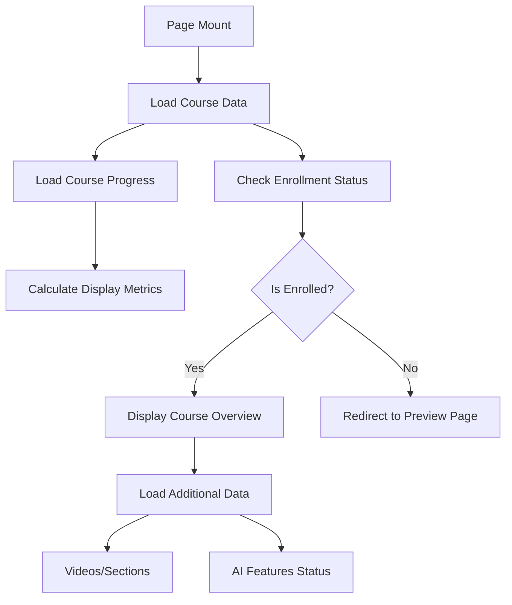

# Student Course Overview Page Implementation Plan

## Date: 2025-08-25
## Route: `/student/course/[id]`
## Priority: HIGH
## Status: Planning Phase

---

## 📋 Executive Summary

The student course overview page serves as the main hub for enrolled students to access their course content, track progress, and navigate to video lessons. This page should provide a comprehensive view of the course structure, learning progress, and AI-powered features while maintaining consistency with the existing UI patterns in the application.

---

## 🔍 Current State Analysis

### Existing Components and Patterns

#### 1. **Public Course Preview Page** (`/course/[id]/page.tsx`)
- Hero section with course info
- AI insights panel
- Instructor information
- Enrollment card with pricing
- Course curriculum tabs
- Reviews section

#### 2. **Student Courses List** (`/student/courses/page.tsx`)
- Progress tracking cards
- Course filtering/search
- Tab-based organization (All/In Progress/Completed)
- Last accessed tracking
- AI interaction metrics

#### 3. **Student Video Player** (`/student/course/[id]/video/[videoId]/page.tsx`)
- Video player integration
- AI chat sidebar
- Progress tracking
- Navigation between videos

### API and Store Integration

#### Available Store Slices:
1. **student-course-slice.ts**
   - `loadCourseById(courseId)`
   - `loadCourseProgress(courseId)`
   - `currentCourse`
   - `courseProgress`
   - `enrolledCourses`

2. **public-course-slice.ts**
   - `loadCourseById(courseId)` - for public course data
   - `currentCourse`

### API Endpoints:
- `GET /api/v1/courses/{id}` - Public course details (404 issue noted)
- `GET /api/v1/student/courses` - Enrolled courses list
- `GET /api/v1/student/courses/{id}/progress` - Course progress

---

## 🎯 Requirements & Goals

### Functional Requirements:
1. Display comprehensive course information for enrolled students
2. Show real-time progress tracking
3. Provide navigation to individual video lessons
4. Display AI-powered learning features
5. Show course structure with sections/modules
6. Handle course not found / not enrolled scenarios

### User Experience Goals:
1. Clear visual progress indicators
2. Easy navigation to continue learning
3. Motivational elements (streaks, achievements)
4. Quick access to AI features
5. Responsive design for all devices

### Technical Requirements:
1. Reuse existing components and patterns
2. Integrate with existing store slices
3. Handle API response formats (Django REST)
4. Maintain type safety
5. Optimize for performance

---

## 🏗️ Implementation Architecture

### Component Structure:
```
/student/course/[id]/
  page.tsx                    # Main course overview page
  
Reusable Components:
/components/
  /course/
    CourseProgress.tsx        # Progress visualization
    CourseCurriculum.tsx      # Lesson list with status
    CourseHeader.tsx          # Hero section with info
    AIFeaturesCard.tsx        # AI capabilities showcase
  /student/
    LearningStats.tsx         # Personal learning metrics
    NextLessonCard.tsx        # Quick continue button
```

### Page Layout Structure:
```
StudentCoursePage
├── CourseHeader
│   ├── Breadcrumbs
│   ├── Course Title & Description
│   ├── Instructor Info
│   └── Course Badges (difficulty, category)
├── Main Content (Grid: 2/3 + 1/3)
│   ├── Left Column
│   │   ├── CourseProgress
│   │   ├── NextLessonCard
│   │   └── CourseCurriculum
│   └── Right Sidebar
│       ├── LearningStats
│       ├── AIFeaturesCard
│       └── CourseResources
└── Footer Navigation
```

---

## 📐 Detailed UI Design

### 1. Course Header Section
```tsx
<CourseHeader>
  - Breadcrumbs: My Courses > {Course Title}
  - Course Title (h1)
  - Course Description
  - Metadata badges:
    * Difficulty level
    * Duration
    * Videos count
    * Category
  - Instructor mini-card
</CourseHeader>
```

### 2. Progress Overview Card
```tsx
<CourseProgress>
  - Overall progress bar (0-100%)
  - Completed: X of Y lessons
  - Estimated time remaining
  - Current streak (if applicable)
  - Last accessed date
  - Certificate status
</CourseProgress>
```

### 3. Continue Learning Card
```tsx
<NextLessonCard>
  - Current/Next video thumbnail
  - Video title
  - Module/Section name
  - "Continue Learning" CTA button
  - Estimated duration
</NextLessonCard>
```

### 4. Course Curriculum List
```tsx
<CourseCurriculum>
  For each section/module:
    - Section header (collapsible)
    - Progress indicator for section
    
  For each video:
    - Status icon (completed/current/locked)
    - Video title
    - Duration
    - Quick actions (play/review)
    - AI features available badge
</CourseCurriculum>
```

### 5. AI Features Showcase
```tsx
<AIFeaturesCard>
  - Puzzle Hint availability
  - Puzzle Check (quizzes)
  - Puzzle Reflect (reflections)
  - AI Chat assistant status
  - Usage limits (if applicable)
</AIFeaturesCard>
```

### 6. Learning Statistics
```tsx
<LearningStats>
  - Total time spent
  - Videos completed
  - Quiz score average
  - Reflection count
  - AI interactions used
  - Learning velocity trend
</LearningStats>
```

---

## 🔄 Data Flow & State Management

### Initial Page Load:


### State Updates:
```typescript
// Primary state from store
const {
  currentCourse,       // Course details
  courseProgress,      // Progress data
  videos,             // Course videos
  loading,            // Loading states
  error              // Error handling
} = useAppStore()

// Derived state
const progressPercent = calculateProgress(courseProgress)
const nextVideo = getNextVideo(videos, courseProgress)
const isCompleted = progressPercent === 100
```

---

## 💻 Implementation Code Structure

### Main Page Component:
```typescript
// /student/course/[id]/page.tsx
export default function StudentCourseOverviewPage() {
  const params = useParams()
  const courseId = params.id as string
  
  const {
    currentCourse,
    courseProgress,
    loadCourseById,
    loadCourseProgress,
    loading,
    error
  } = useAppStore()
  
  useEffect(() => {
    // Load course and progress data
    loadCourseById(courseId)
    loadCourseProgress(courseId)
  }, [courseId])
  
  // Error handling
  if (loading) return <LoadingSpinner />
  if (error) return <ErrorFallback error={error} />
  if (!currentCourse) return <CourseNotFound />
  
  return (
    <div className="container mx-auto px-4 py-8">
      <CourseHeader course={currentCourse} />
      
      <div className="grid gap-8 lg:grid-cols-3 mt-8">
        <div className="lg:col-span-2">
          <CourseProgress 
            progress={courseProgress} 
            course={currentCourse}
          />
          <NextLessonCard 
            nextVideo={getNextVideo()} 
            courseId={courseId}
          />
          <CourseCurriculum 
            videos={currentCourse.videos}
            progress={courseProgress}
            courseId={courseId}
          />
        </div>
        
        <div className="space-y-6">
          <LearningStats progress={courseProgress} />
          <AIFeaturesCard course={currentCourse} />
          <CourseResources course={currentCourse} />
        </div>
      </div>
    </div>
  )
}
```

---

## 🔌 API Integration Points

### Required API Calls:
1. **Course Details**: `GET /api/v1/courses/{id}`
   - Handle 404 for non-existent courses
   - Parse Django REST response format

2. **Course Progress**: `GET /api/v1/student/courses/{id}/progress`
   - Update progress in real-time
   - Cache for performance

3. **Course Sections**: `GET /api/v1/content/courses/{id}/sections`
   - If course has sections structure
   - Group videos by section

### Response Handling:
```typescript
// Handle Django REST Framework response
if (response.status === 200) {
  const data = response.data.results || response.data
  // Process data...
}

// Handle 404 - Course not found
if (response.status === 404) {
  return <CourseNotFound />
}
```

---

## 🎨 UI Components to Reuse

### From Existing Codebase:
1. **Progress Component** - from `/components/ui/progress`
2. **Card Components** - from `/components/ui/card`
3. **Badge Component** - from `/components/ui/badge`
4. **Button Component** - from `/components/ui/button`
5. **LoadingSpinner** - from `/components/common`
6. **ErrorFallback** - from `/components/common`

### Icons (Lucide React):
- `Play`, `CheckCircle2`, `Lock` - for video status
- `Clock`, `Calendar` - for time tracking
- `Brain`, `Sparkles` - for AI features
- `Award`, `Trophy` - for achievements
- `ChevronRight`, `ChevronDown` - for navigation

---

## 📊 Progress Calculation Logic

```typescript
interface CourseProgress {
  videosCompleted: number
  totalVideos: number
  percentComplete: number
  lastAccessedAt: string
  currentVideoId?: string
}

function calculateProgress(progress: CourseProgress): {
  percent: number
  status: 'not-started' | 'in-progress' | 'completed'
  nextMilestone: string
} {
  const percent = progress.percentComplete || 0
  
  const status = 
    percent === 0 ? 'not-started' :
    percent === 100 ? 'completed' : 
    'in-progress'
  
  const nextMilestone = 
    percent < 25 ? 'Complete first module' :
    percent < 50 ? 'Reach halfway point' :
    percent < 75 ? 'Enter final stretch' :
    percent < 100 ? 'Complete final lessons' :
    'Course completed!'
    
  return { percent, status, nextMilestone }
}
```

---

## 🚀 Implementation Phases

### Phase 1: Core Structure (Day 1)
- [ ] Create basic page structure
- [ ] Integrate with store for course data
- [ ] Handle loading and error states
- [ ] Basic course header with info

### Phase 2: Progress Features (Day 2)
- [ ] Implement progress tracking UI
- [ ] Create curriculum list with status
- [ ] Add continue learning card
- [ ] Video navigation logic

### Phase 3: Enhanced Features (Day 3)
- [ ] Add AI features showcase
- [ ] Implement learning statistics
- [ ] Add course resources section
- [ ] Polish animations and transitions

### Phase 4: Testing & Optimization (Day 4)
- [ ] Test with real API data
- [ ] Handle edge cases (no videos, 404)
- [ ] Optimize performance
- [ ] Mobile responsiveness

---

## ⚠️ Known Issues & Solutions

### Issue 1: Course API 404
**Problem**: Backend returns 404 for course ID
**Solution**: 
- Verify course exists in database
- Show appropriate error message
- Provide navigation to courses list

### Issue 2: Django REST Response Format
**Problem**: Response uses `results` instead of `data`
**Solution**: Already handled in service layer with proper parsing

### Issue 3: Missing Route
**Problem**: `/student/course/[id]/page.tsx` was missing
**Solution**: Created with this implementation

---

## ✅ Success Metrics

1. **Functional Completeness**
   - [ ] All course information displayed
   - [ ] Progress tracking works correctly
   - [ ] Navigation to videos functional
   - [ ] AI features properly showcased

2. **User Experience**
   - [ ] Page loads within 2 seconds
   - [ ] Smooth transitions between states
   - [ ] Clear visual hierarchy
   - [ ] Mobile responsive design

3. **Code Quality**
   - [ ] Follows existing patterns
   - [ ] Properly typed (TypeScript)
   - [ ] Error handling in place
   - [ ] Components are reusable

---

## 🔮 Future Enhancements

1. **Gamification**
   - Learning streaks
   - Badges and achievements
   - Leaderboards
   - Points system

2. **Social Features**
   - Study groups
   - Discussion forums
   - Peer progress comparison
   - Share achievements

3. **Advanced Analytics**
   - Learning patterns visualization
   - Time spent per topic
   - Difficulty analysis
   - Personalized recommendations

4. **Offline Support**
   - Download videos for offline viewing
   - Sync progress when online
   - Offline quiz attempts

---

## 📝 Notes for Implementation

1. **Priority Order**:
   - Fix API integration first (404 issue)
   - Basic page with course info
   - Progress tracking
   - Enhanced features

2. **Testing Checklist**:
   - Test with valid course ID
   - Test with invalid course ID
   - Test enrolled vs non-enrolled
   - Test progress calculation
   - Test on mobile devices

3. **Performance Considerations**:
   - Lazy load video list if many videos
   - Cache progress data
   - Optimize image loading
   - Use React.memo for heavy components

---

## 🤝 Dependencies

- Store slices properly configured
- API endpoints returning correct data
- Authentication system for user ID
- Course enrollment verification

---

## 📚 References

- Existing course preview: `/course/[id]/page.tsx`
- Student courses list: `/student/courses/page.tsx`
- Video player page: `/student/course/[id]/video/[videoId]/page.tsx`
- API documentation: Postman collection
- Previous implementation plans in `/nh-logs/api-integreation/`

---

**Document Version**: 1.0
**Last Updated**: 2025-08-25
**Author**: Development Team
**Status**: Ready for Implementation