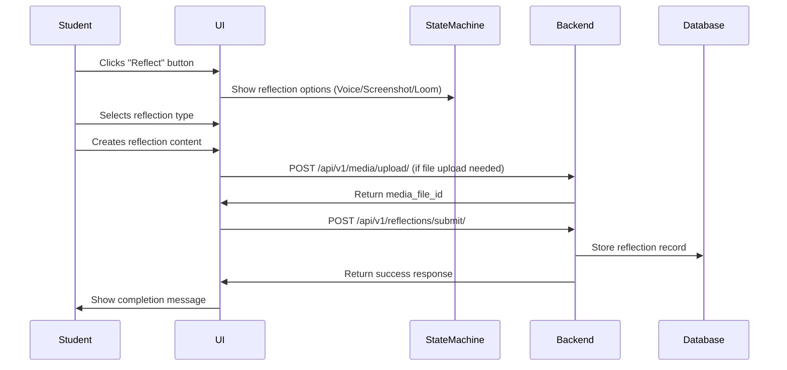

# PuzzleReflect Backend Development Guide
**Date:** August 28, 2025 (Updated)  
**Purpose:** Simplified backend implementation guide for the PuzzleReflect functionality  
**Frontend Integration Status:** ✅ Fully implemented and ready for backend integration

---

## 📋 **Executive Summary**

PuzzleReflect is a streamlined learning reflection system that allows students to capture and reflect on their learning moments through multiple media formats. The system focuses on direct media submission without AI-generated prompts, making it simpler and more intuitive.

### **Key Features:**
- **Multi-Modal Reflections**: Voice memos, screenshots, and Loom video recordings
- **Contextual Timing**: All reflections are timestamped to specific video moments
- **Direct Submission**: Students reflect naturally without AI-generated prompts
- **Media Integration**: Leverages existing media file system
- **Seamless UX**: Integrated into video learning experience

---

## 🏗️ **System Architecture Overview**

### **Frontend Architecture (Implemented)**
```
Student Video Page
├── AIChatSidebarV2 (UI Component)
├── VideoAgentStateMachine (State Management)
├── ReflectionData Types (Data Structure)
└── API Integration Points (Ready for Backend)
```

### **Required Backend Architecture**
```
Django Backend
├── Reflection Storage Service (Single Table)
├── Existing Media Upload System (Reused)
├── Analytics & Tracking Service (Optional)
└── API Endpoints (2 endpoints needed)
```

---

## 📊 **Data Flow Analysis**

### **Simplified Reflection Flow**


---

## 🔗 **Required API Endpoints**

### **1. Media Upload (Use Existing Endpoint)**
**Endpoint:** `POST /api/v1/media/upload/`  
**Purpose:** Upload voice recordings and screenshots using existing media system  
**Frontend Usage:** Called when student uploads files for reflection

**Request:** `multipart/form-data`
```
file: [Binary file - audio/image]
user_id: "user-456"
file_type: "reflection_voice" | "reflection_screenshot"
```

**Response:**
```json
{
  "success": true,
  "media_file_id": "media-uuid-12345",
  "file_url": "/media/reflections/user-456/file-12345.wav",
  "file_size": 245760,
  "mime_type": "audio/wav"
}
```

### **2. Reflection Submission**
**Endpoint:** `POST /api/v1/reflections/submit/`  
**Purpose:** Store completed reflection with metadata  
**Frontend Usage:** Called when student submits any reflection type

**Request:**
```json
{
  "user_id": "user-456",
  "video_id": "video-123",
  "course_id": "course-789",
  "video_timestamp": 120.5,
  "reflection_type": "voice", // "voice", "screenshot", "loom"
  
  // For uploaded files (voice/screenshot)
  "media_file_id": "media-uuid-12345",
  
  // For external links (Loom)
  "external_url": "https://loom.com/share/video-id",
  
  // Optional metadata
  "duration": 15.7, // For voice memos
  "notes": "Optional user notes or annotations"
}
```

**Response:**
```json
{
  "success": true,
  "reflection_id": "refl-uuid-12345",
  "message": "Reflection saved successfully",
  "created_at": "2025-08-28T14:30:00Z"
}
```

### **3. Reflection History (Optional)**
**Endpoint:** `GET /api/v1/reflections/history/`  
**Purpose:** Retrieve user's reflection history  
**Frontend Usage:** Display reflection history in student dashboard

**Query Parameters:**
```
?user_id=user-456&video_id=video-123&limit=10&offset=0
```

**Response:**
```json
{
  "reflections": [
    {
      "id": "refl-uuid-12345",
      "reflection_type": "voice",
      "video_timestamp": 120.5,
      "created_at": "2025-08-28T14:30:00Z",
      "media_file": {
        "file_url": "/media/reflections/audio-12345.wav",
        "file_size": 245760
      },
      "duration": 15.7,
      "notes": "My reflection about flexbox..."
    }
  ],
  "total": 25,
  "has_next": true
}
```

---

## 🎯 **Frontend Integration Points**

### **1. Data Structures (Already Implemented)**

**ReflectionData Interface:**
```typescript
export interface ReflectionData {
  type: 'voice' | 'screenshot' | 'loom'
  content?: string  // URL or base64 data
  duration?: number // For voice memos
  transcript?: string // For voice transcription
  videoTimestamp?: number // Video timestamp when reflection was made
}
```

**Message Integration:**
```typescript
export interface Message {
  // ... other fields
  reflectionData?: ReflectionData
  type: 'reflection-options' | 'reflection-complete' // New message types
}
```

### **2. State Machine Integration (Already Implemented)**

**Key State Machine Methods:**
```typescript
// In VideoAgentStateMachine class
private async startReflection(updatedMessages: Message[])
private async handleReflectionTypeChosen(payload: { type: string })
private async handleReflectionSubmit(payload: { type: string, data: any })
private async handleReflectionCancel()
```

**Event Handlers:**
```typescript
// In AIChatSidebarV2 component
onReflectionTypeChosen?: (type: string) => void
onReflectionSubmit?: (type: string, data: ReflectionData) => void
```

### **3. UI Component Integration (Already Implemented)**

**AIChatSidebarV2 Features:**
- ✅ Voice recording with real-time timer
- ✅ Audio playback controls
- ✅ Screenshot capture button
- ✅ Loom URL input
- ✅ Reflection type selection UI
- ✅ Loading states and error handling

---

## 📁 **Database Schema Requirements**

### **Single Reflections Table**
```sql
CREATE TABLE reflections (
    id UUID PRIMARY KEY DEFAULT gen_random_uuid(),
    user_id UUID NOT NULL REFERENCES users(id),
    video_id UUID NOT NULL REFERENCES videos(id),
    course_id UUID REFERENCES courses(id),
    
    -- Timing and type
    video_timestamp DECIMAL(10,2) NOT NULL,
    reflection_type VARCHAR(20) NOT NULL CHECK (reflection_type IN ('voice', 'screenshot', 'loom')),
    
    -- Media relation (leverages existing media_files table)
    media_file_id UUID REFERENCES media_files(id), -- For voice/screenshot uploads
    
    -- External content (for Loom videos)
    external_url TEXT, -- For Loom URLs
    
    -- Metadata
    duration DECIMAL(6,2), -- For voice memos
    notes TEXT, -- User annotations or notes
    
    -- Timestamps
    created_at TIMESTAMP DEFAULT NOW(),
    updated_at TIMESTAMP DEFAULT NOW(),
    
    INDEXES (user_id, video_id, created_at, reflection_type)
);
```

### **Existing Media Files Table (Reused)**
```sql
-- This table already exists in your system
-- No changes needed - PuzzleReflect will use it via media_file_id foreign key

-- media_files (
--     id UUID PRIMARY KEY,
--     user_id UUID REFERENCES users(id),
--     file_path TEXT NOT NULL,
--     file_type VARCHAR(50),
--     file_size INTEGER,
--     original_filename TEXT,
--     mime_type TEXT,
--     created_at TIMESTAMP DEFAULT NOW()
-- )
```

### **Benefits of This Schema:**
✅ **Single Table Simplicity** - Only one new table needed  
✅ **Reuses Existing Infrastructure** - Leverages media_files table  
✅ **Clean Relations** - Simple foreign key to existing media system  
✅ **Flexible Content Types** - Handles voice, screenshots, and Loom URLs  
✅ **Minimal Storage** - No duplicate file metadata

---

## 🔧 **Backend Implementation Checklist**

### **Phase 1: Core Setup (Week 1)**
- [ ] Create Django model for reflections table
- [ ] Set up database migration
- [ ] Implement reflection submission endpoint
- [ ] Test integration with existing media upload system

### **Phase 2: API Development (Week 1-2)**
- [ ] Build POST /api/v1/reflections/submit/ endpoint
- [ ] Add reflection history endpoint (optional)
- [ ] Implement proper error handling and validation
- [ ] Add API documentation

### **Phase 3: Testing & Integration (Week 2)**
- [ ] Unit tests for reflection endpoints
- [ ] Integration tests with frontend
- [ ] Test with all reflection types (voice, screenshot, Loom)
- [ ] Performance testing for file uploads

### **Phase 4: Optional Enhancements (Week 2-3)**
- [ ] Add reflection analytics (optional)
- [ ] Implement search/filtering for reflection history
- [ ] Add bulk operations for instructor dashboard
- [ ] Optimize database queries

---

## 🚀 **Deployment Considerations**

### **Media Storage**
```python
# settings.py
MEDIA_ROOT = '/path/to/media/storage'
REFLECTION_UPLOAD_PATH = 'reflections/{user_id}/{reflection_type}/'

# For production
AWS_STORAGE_BUCKET_NAME = 'unpuzzle-reflections'
AWS_S3_CUSTOM_DOMAIN = f'{AWS_STORAGE_BUCKET_NAME}.s3.amazonaws.com'
```

### **File Upload Limits**
```python
# settings.py
FILE_UPLOAD_MAX_MEMORY_SIZE = 10 * 1024 * 1024  # 10MB for voice memos
DATA_UPLOAD_MAX_MEMORY_SIZE = 50 * 1024 * 1024   # 50MB for screenshots

# Reflection-specific limits
VOICE_MEMO_MAX_DURATION = 300  # 5 minutes
VOICE_MEMO_MAX_SIZE = 25 * 1024 * 1024  # 25MB
SCREENSHOT_MAX_SIZE = 10 * 1024 * 1024   # 10MB
```

### **Background Processing**
```python
# For async tasks like transcription and AI processing
# celery.py
@app.task
def process_voice_reflection(reflection_id):
    # Generate transcript
    # Get AI feedback
    # Update reflection record
    pass

@app.task  
def generate_reflection_analytics(user_id, time_period):
    # Calculate learning impact scores
    # Generate insights
    # Update analytics dashboard
    pass
```

---

## 📊 **Success Metrics**

### **Technical Metrics**
- **Upload Success Rate**: >99% for all media types
- **API Response Time**: <200ms for reflection submission
- **File Processing Time**: Use existing media upload pipeline
- **Storage Efficiency**: Leverage existing media storage system

### **Learning Metrics**
- **Reflection Completion Rate**: Target >80%
- **Engagement Frequency**: Students creating reflections regularly
- **Media Type Distribution**: Track usage of voice vs screenshot vs Loom
- **User Satisfaction**: >4.5/5 rating for reflection feature

---

## 🔒 **Security & Privacy**

### **Data Protection**
- All reflection content encrypted at rest
- Audio files automatically deleted after transcript generation (optional)
- User consent required for AI processing of reflection content
- GDPR compliance for reflection data export/deletion

### **File Upload Security**
- Virus scanning for all uploaded files
- File type validation (whitelist only)
- Size limits enforced
- User authentication required for all uploads

---

## 📋 **Next Steps**

1. **Database Setup**: Create the single reflections table
2. **Backend Development**: Implement POST /api/v1/reflections/submit/ endpoint
3. **Media Integration**: Ensure integration with existing media upload system
4. **Testing**: Test all reflection types with the implemented frontend
5. **Optional Features**: Add reflection history and analytics if needed

---

**Document Status:** ✅ Updated - Simplified Architecture  
**Frontend Status:** ✅ Fully Implemented - Ready for Integration  
**Estimated Backend Development Time:** 1-2 weeks (simplified)  
**Priority Level:** High - Core learning feature

### **Key Simplifications Made:**
- ❌ Removed AI prompt generation (unnecessary complexity)
- ❌ Removed separate prompts table (not needed)
- ❌ Removed analytics table (optional feature)
- ✅ Single reflections table with media_files relation
- ✅ Reuse existing media upload system
- ✅ Direct file submission workflow
- ✅ Reduced from 6 to 2-3 API endpoints