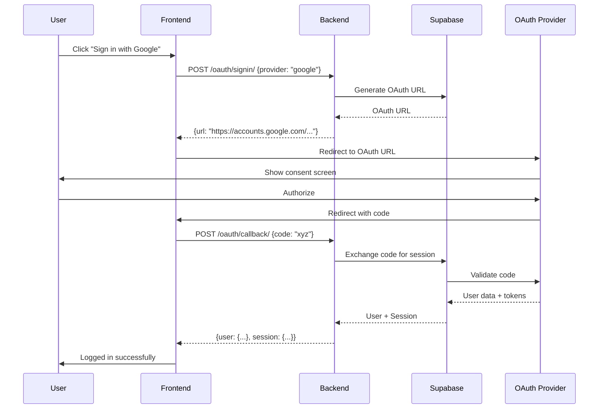
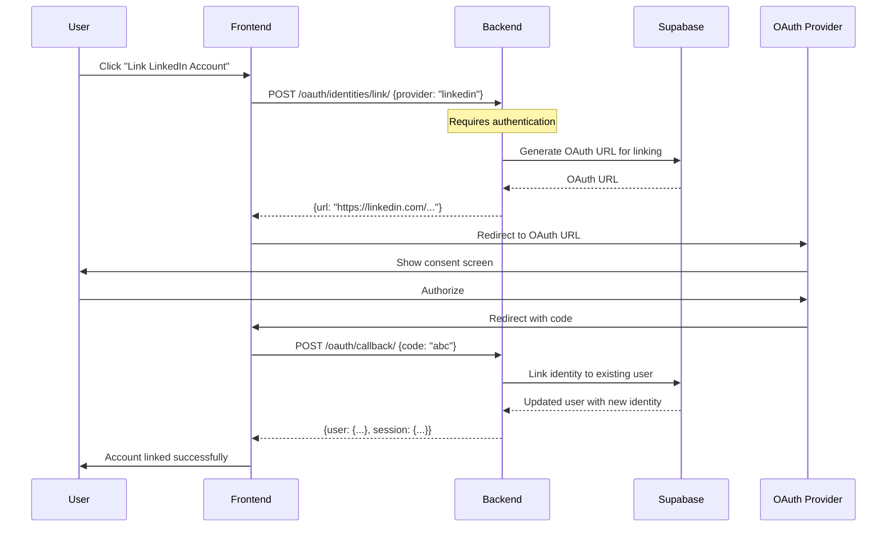

# OAuth API Documentation

## Base URL
```
https://your-domain.com/api/v1/auth
```

## Authentication
Most OAuth endpoints are public, except for identity management endpoints which require a valid JWT token in either:
- Cookie: `auth_token`
- Header: `Authorization: Bearer <token>`

---

## Endpoints

### 1. Get Supported Providers
Get a list of all supported OAuth providers.

**Endpoint:** `GET /oauth/providers/`

**Authentication:** Not required

**Response:**
```json
{
  "success": true,
  "providers": [
    {
      "id": "google",
      "name": "Google",
      "enabled": true,
      "icon": "google"
    },
    {
      "id": "linkedin",
      "name": "LinkedIn",
      "enabled": true,
      "icon": "linkedin"
    },
    {
      "id": "github",
      "name": "GitHub",
      "enabled": true,
      "icon": "github"
    }
    // ... more providers
  ]
}
```

**Status Codes:**
- `200 OK` - Success

---

### 2. Initiate OAuth Sign In
Start the OAuth authentication flow for a specific provider.

**Endpoint:** `POST /oauth/signin/`

**Authentication:** Not required

**Request Body:**
```json
{
  "provider": "google",
  "redirect_url": "https://yourapp.com/auth/callback"  // optional
}
```

**Parameters:**
| Field | Type | Required | Description |
|-------|------|----------|-------------|
| `provider` | string | Yes | OAuth provider identifier (google, linkedin, github, etc.) |
| `redirect_url` | string | No | URL to redirect after authentication. Defaults to `FRONTEND_URL/auth/callback` |

**Response:**
```json
{
  "success": true,
  "url": "https://accounts.google.com/o/oauth2/v2/auth?client_id=...&redirect_uri=...",
  "provider": "google"
}
```

**Status Codes:**
- `200 OK` - Success, returns OAuth URL
- `400 Bad Request` - Invalid provider or missing required fields
- `500 Internal Server Error` - Server error generating OAuth URL

**Example:**
```bash
curl -X POST https://your-domain.com/api/v1/auth/oauth/signin/ \
  -H "Content-Type: application/json" \
  -d '{"provider": "google"}'
```

---

### 3. OAuth Callback
Handle the OAuth callback and exchange authorization code for user session.

**Endpoint:** `POST /oauth/callback/` or `GET /oauth/callback/`

**Authentication:** Not required

**Request Body (POST):**
```json
{
  "code": "authorization_code_from_provider"
}
```

**Query Parameters (GET):**
```
?code=authorization_code_from_provider
```

**Parameters:**
| Field | Type | Required | Description |
|-------|------|----------|-------------|
| `code` | string | Yes | Authorization code from OAuth provider |

**Response:**
```json
{
  "success": true,
  "user": {
    "supabase_user_id": "uuid",
    "email": "user@example.com",
    "username": "johndoe",
    "full_name": "John Doe",
    "display_name": "John",
    "avatar_url": "https://lh3.googleusercontent.com/...",
    "bio": null,
    "status": "active",
    "phone_number": null,
    "timezone": "UTC",
    "language": "en",
    "last_login": "2024-01-15T10:30:00Z",
    "email_verified": true,
    "created_at": "2024-01-15T10:30:00Z",
    "updated_at": "2024-01-15T10:30:00Z",
    "roles": ["student"]
  },
  "session": {
    "access_token": "eyJhbGciOiJIUzI1NiIsInR5cCI6IkpXVCJ9...",
    "refresh_token": "refresh_token_here",
    "expires_in": 3600,
    "expires_at": 1704123456,
    "token_type": "bearer"
  }
}
```

**Status Codes:**
- `200 OK` - Success, user authenticated
- `400 Bad Request` - Invalid or missing authorization code
- `500 Internal Server Error` - Server error or profile creation failed

**Notes:**
- Sets `auth_token` cookie with access token
- UserProfile is automatically created via database trigger
- Default role (student) is assigned to new users
- Profile fields (name, avatar) are populated from OAuth provider

---

### 4. Get Linked Identities
Get all OAuth providers linked to the current user's account.

**Endpoint:** `GET /oauth/identities/`

**Authentication:** Required

**Headers:**
```
Authorization: Bearer <access_token>
```

**Response:**
```json
{
  "success": true,
  "identities": [
    {
      "id": "identity_uuid",
      "provider": "google",
      "created_at": "2024-01-15T10:30:00Z",
      "updated_at": "2024-01-15T10:30:00Z",
      "email": "user@gmail.com",
      "identity_data": {
        "email": "user@gmail.com",
        "name": "John Doe",
        "avatar_url": "https://lh3.googleusercontent.com/...",
        "provider_id": "1234567890"
      }
    },
    {
      "id": "another_identity_uuid",
      "provider": "github",
      "created_at": "2024-01-16T14:20:00Z",
      "updated_at": "2024-01-16T14:20:00Z",
      "email": "user@example.com",
      "identity_data": {
        "email": "user@example.com",
        "name": "johndoe",
        "avatar_url": "https://avatars.githubusercontent.com/...",
        "provider_id": "987654321"
      }
    }
  ]
}
```

**Status Codes:**
- `200 OK` - Success
- `401 Unauthorized` - Not authenticated or invalid token
- `500 Internal Server Error` - Server error

---

### 5. Link New Identity
Link a new OAuth provider to an existing user account.

**Endpoint:** `POST /oauth/identities/link/`

**Authentication:** Required

**Headers:**
```
Authorization: Bearer <access_token>
```

**Request Body:**
```json
{
  "provider": "linkedin",
  "redirect_url": "https://yourapp.com/settings/linked-accounts"  // optional
}
```

**Parameters:**
| Field | Type | Required | Description |
|-------|------|----------|-------------|
| `provider` | string | Yes | OAuth provider to link |
| `redirect_url` | string | No | URL to redirect after linking. Defaults to `FRONTEND_URL/settings/linked-accounts` |

**Response:**
```json
{
  "success": true,
  "url": "https://www.linkedin.com/oauth/v2/authorization?...",
  "provider": "linkedin",
  "action": "link"
}
```

**Status Codes:**
- `200 OK` - Success, returns OAuth URL for linking
- `400 Bad Request` - Invalid provider
- `401 Unauthorized` - Not authenticated
- `500 Internal Server Error` - Server error

**Notes:**
- User must complete OAuth flow to link the identity
- Same callback endpoint handles both sign in and linking

---

### 6. Unlink Identity
Remove a linked OAuth provider from user account.

**Endpoint:** `DELETE /oauth/identities/<identity_id>/unlink/`

**Authentication:** Required

**Headers:**
```
Authorization: Bearer <access_token>
```

**Parameters:**
| Field | Type | Required | Description |
|-------|------|----------|-------------|
| `identity_id` | string | Yes | UUID of the identity to unlink (in URL) |

**Response:**
```json
{
  "success": true,
  "message": "Identity unlinked successfully"
}
```

**Error Response:**
```json
{
  "error": "Cannot unlink the only authentication method"
}
```

**Status Codes:**
- `200 OK` - Success, identity unlinked
- `400 Bad Request` - Cannot unlink last auth method or unlink failed
- `401 Unauthorized` - Not authenticated
- `500 Internal Server Error` - Server error

**Notes:**
- Cannot unlink the last authentication method
- User must have either a password or another OAuth provider linked

---

## OAuth Flow Diagrams

### Sign In Flow


### Link Identity Flow


---

## Error Handling

### Common Error Responses

**Invalid Provider:**
```json
{
  "error": "Unsupported provider: invalid_provider",
  "supported_providers": ["google", "linkedin", "github", "facebook", "twitter", "apple", "microsoft", "gitlab", "discord", "spotify"]
}
```

**Missing Authorization Code:**
```json
{
  "error": "Authorization code is required"
}
```

**Not Authenticated:**
```json
{
  "error": "Not authenticated"
}
```

**Cannot Unlink Last Auth Method:**
```json
{
  "error": "Cannot unlink the only authentication method"
}
```

**Profile Creation Failed:**
```json
{
  "error": "Profile not created. Check database triggers.",
  "user_id": "uuid"
}
```

---

## Implementation Examples

### JavaScript/TypeScript

```typescript
// 1. Get supported providers
async function getSupportedProviders() {
  const response = await fetch('/api/v1/auth/oauth/providers/');
  const data = await response.json();
  return data.providers;
}

// 2. Initiate OAuth sign in
async function signInWithOAuth(provider: string) {
  const response = await fetch('/api/v1/auth/oauth/signin/', {
    method: 'POST',
    headers: { 'Content-Type': 'application/json' },
    body: JSON.stringify({ provider })
  });
  
  const data = await response.json();
  if (data.success) {
    window.location.href = data.url;
  }
}

// 3. Handle OAuth callback
async function handleOAuthCallback() {
  const params = new URLSearchParams(window.location.search);
  const code = params.get('code');
  
  if (code) {
    const response = await fetch('/api/v1/auth/oauth/callback/', {
      method: 'POST',
      headers: { 'Content-Type': 'application/json' },
      body: JSON.stringify({ code })
    });
    
    const data = await response.json();
    if (data.success) {
      // Store tokens, update user state
      localStorage.setItem('user', JSON.stringify(data.user));
      // Redirect to dashboard
      window.location.href = '/dashboard';
    }
  }
}

// 4. Link new OAuth provider
async function linkOAuthProvider(provider: string, token: string) {
  const response = await fetch('/api/v1/auth/oauth/identities/link/', {
    method: 'POST',
    headers: {
      'Content-Type': 'application/json',
      'Authorization': `Bearer ${token}`
    },
    body: JSON.stringify({ provider })
  });
  
  const data = await response.json();
  if (data.success) {
    window.location.href = data.url;
  }
}

// 5. Unlink OAuth provider
async function unlinkOAuthProvider(identityId: string, token: string) {
  const response = await fetch(`/api/v1/auth/oauth/identities/${identityId}/unlink/`, {
    method: 'DELETE',
    headers: {
      'Authorization': `Bearer ${token}`
    }
  });
  
  const data = await response.json();
  return data.success;
}
```

### React Example

```jsx
import { useState, useEffect } from 'react';

function OAuthSignIn() {
  const [providers, setProviders] = useState([]);
  
  useEffect(() => {
    fetch('/api/v1/auth/oauth/providers/')
      .then(res => res.json())
      .then(data => setProviders(data.providers));
  }, []);
  
  const handleOAuthSignIn = async (provider) => {
    const response = await fetch('/api/v1/auth/oauth/signin/', {
      method: 'POST',
      headers: { 'Content-Type': 'application/json' },
      body: JSON.stringify({ provider })
    });
    
    const data = await response.json();
    if (data.success) {
      window.location.href = data.url;
    }
  };
  
  return (
    <div className="oauth-providers">
      {providers.map(provider => (
        <button
          key={provider.id}
          onClick={() => handleOAuthSignIn(provider.id)}
          className={`oauth-btn oauth-${provider.icon}`}
        >
          Sign in with {provider.name}
        </button>
      ))}
    </div>
  );
}
```

---

## Security Considerations

1. **HTTPS Only**: All OAuth flows must use HTTPS in production
2. **CSRF Protection**: Supabase handles state parameter automatically
3. **Token Storage**: Access tokens are set as httpOnly cookies
4. **Secure Headers**: Always use Bearer token in Authorization header
5. **Identity Verification**: Email from OAuth provider is trusted as verified
6. **Rate Limiting**: Apply rate limiting to OAuth endpoints
7. **Redirect URL Validation**: Only allow whitelisted redirect URLs

---

## Testing with cURL

```bash
# 1. Get supported providers
curl https://your-domain.com/api/v1/auth/oauth/providers/

# 2. Initiate OAuth sign in
curl -X POST https://your-domain.com/api/v1/auth/oauth/signin/ \
  -H "Content-Type: application/json" \
  -d '{"provider": "google"}'

# 3. Handle OAuth callback
curl -X POST https://your-domain.com/api/v1/auth/oauth/callback/ \
  -H "Content-Type: application/json" \
  -d '{"code": "authorization_code_here"}'

# 4. Get linked identities (requires auth)
curl https://your-domain.com/api/v1/auth/oauth/identities/ \
  -H "Authorization: Bearer YOUR_ACCESS_TOKEN"

# 5. Link new provider (requires auth)
curl -X POST https://your-domain.com/api/v1/auth/oauth/identities/link/ \
  -H "Content-Type: application/json" \
  -H "Authorization: Bearer YOUR_ACCESS_TOKEN" \
  -d '{"provider": "linkedin"}'

# 6. Unlink provider (requires auth)
curl -X DELETE https://your-domain.com/api/v1/auth/oauth/identities/IDENTITY_ID/unlink/ \
  -H "Authorization: Bearer YOUR_ACCESS_TOKEN"
```

---

## Troubleshooting

### Provider Not Working
- Verify provider is enabled in Supabase Dashboard
- Check OAuth credentials are correctly configured
- Ensure redirect URLs are whitelisted

### Callback Fails
- Check authorization code is being passed
- Verify redirect URL matches configuration
- Check Supabase logs for errors

### Identity Linking Issues
- Ensure user is authenticated
- Check if provider is already linked
- Verify OAuth flow completes successfully

### Database Errors
- Check UserProfile trigger is active
- Verify database permissions
- Check Supabase connection

---

## Support

For issues or questions:
- Check Supabase Dashboard logs
- Review server error logs
- Contact support with request ID and error details