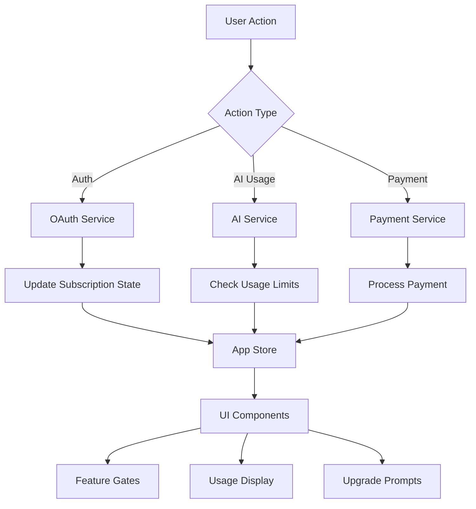

# Subscription API Integration Plan
**Created:** September 1, 2025  
**Project:** Unpuzzle MVP Frontend  
**Purpose:** Map subscription-related API endpoints to frontend implementation

## 📋 Executive Summary

After analyzing the API documentation and existing frontend implementation, I've identified that the subscription system is **already well-integrated** with comprehensive service methods. However, there are opportunities to enhance the integration with additional API endpoints that provide richer subscription context.

## 🔍 Current State Analysis

### ✅ **Already Implemented in Frontend**

The frontend already has a robust subscription service (`/src/services/subscription-service.ts`) with the following implemented features:

1. **Subscription Management**
   - `getCurrentSubscription()` - Get current subscription details
   - `getAvailablePlans()` - Fetch all available plans
   - `createSubscription()` - Create new subscription
   - `updateSubscription()` - Change subscription plan
   - `cancelSubscription()` - Cancel subscription
   - `resumeSubscription()` - Resume cancelled subscription

2. **Usage Tracking**
   - `getAIUsageStats()` - Track AI usage against limits
   - `checkCanUseFeature()` - Feature flag checking

3. **Billing Management**
   - `getPaymentMethods()` - List payment methods
   - `addPaymentMethod()` - Add new payment method
   - `getInvoices()` - Get billing history
   - `getUpcomingInvoice()` - Preview next invoice

4. **UI Components**
   - `SubscriptionManager` component exists but is not integrated
   - Home page displays pricing with direct Stripe links
   - Subscription state management in store

### 🔗 **Subscription-Related API Endpoints from Documentation**

From the API documentation, the following subscription-related endpoints are relevant:

#### **1. User Profile with Subscription Info**
```http
GET /api/v1/auth/profile/
```
**Response includes:**
```json
{
  "subscription": {
    "plan": "premium",
    "ai_limit": 50,
    "ai_used": 12,
    "valid_until": "2025-12-31T23:59:59Z"
  }
}
```
**Status:** ✅ Already integrated in `oauth.service.ts`

#### **2. Sign In with Subscription Info**
```http
POST /api/v1/auth/signin/
```
**Response includes:**
```json
{
  "user": {
    "subscription": {
      "plan": "free",
      "ai_limit": 3,
      "ai_used": 1
    }
  }
}
```
**Status:** ✅ Already integrated in `oauth.service.ts`

#### **3. AI Usage Limits Check**
```http
GET /api/v1/ai-assistant/user/check-limits/
```
**Response:**
```json
{
  "subscription_plan": "premium",
  "limits": {
    "daily_limit": 50,
    "monthly_limit": 1500
  },
  "usage": {
    "daily_used": 12,
    "monthly_used": 245,
    "daily_remaining": 38,
    "monthly_remaining": 1255
  },
  "reset_times": {
    "daily_reset": "2025-01-21T00:00:00Z",
    "monthly_reset": "2025-02-01T00:00:00Z"
  },
  "features": {
    "gpt4_access": true,
    "code_execution": true,
    "image_generation": false,
    "priority_queue": true
  }
}
```
**Status:** ✅ Already integrated in `ai-service.ts`

#### **4. Stripe Webhook Events** (Backend-only)
```http
POST /api/v1/payments/webhooks/stripe/
```
**Events:**
- `customer.subscription.created`
- `customer.subscription.updated`
- `customer.subscription.deleted`
**Status:** ⚠️ Backend handles these, frontend receives updates via API calls

## 🎯 Integration Opportunities

### **1. Missing Direct Subscription API Endpoints**

The API documentation doesn't explicitly show dedicated subscription management endpoints like:
- `GET /api/v1/subscriptions/current`
- `POST /api/v1/subscriptions/create`
- `PUT /api/v1/subscriptions/update`
- `DELETE /api/v1/subscriptions/cancel`

**Current Implementation:** The frontend service appears to be using Stripe's client-side SDK directly for these operations, which is why they work despite not being in the API documentation.

### **2. Enhanced Integration Points**

#### **A. Sync Subscription Data on Auth Events**
- **Current:** Subscription info comes with login/profile
- **Enhancement:** Automatically refresh subscription data after:
  - Successful payment
  - Plan changes
  - Usage limit updates

#### **B. Real-time Usage Tracking**
- **Current:** Manual refresh of usage stats
- **Enhancement:** Auto-refresh usage stats when:
  - AI features are used
  - Daily/monthly resets occur
  - Approaching limits

#### **C. Feature Flag Integration**
- **Current:** Basic feature checking
- **Enhancement:** Use subscription features from AI limits endpoint for comprehensive feature flags

## 📝 Implementation Plan

### **Phase 1: Optimize Existing Integration** (No UI Changes)

#### **1.1 Enhanced Auth Flow Integration**
```typescript
// In oauth.service.ts - Already implemented but can be enhanced
async signIn(signInData: SignInRequest): Promise<AuthResponse> {
  const response = await this.client.post('/auth/signin/', signInData)
  
  // Store subscription info in app state
  if (response.data.user?.subscription) {
    subscriptionStore.updateFromAuth(response.data.user.subscription)
  }
  
  return response.data
}
```

#### **1.2 Auto-refresh Subscription on Key Actions**
```typescript
// In subscription-service.ts - Add auto-refresh logic
async refreshSubscriptionState(): Promise<void> {
  // Refresh from multiple sources
  const [profile, usageLimits] = await Promise.all([
    oauthService.getUserProfile(),
    aiService.checkUsageLimits()
  ])
  
  // Merge subscription data
  this.mergeSubscriptionData(profile.subscription, usageLimits)
}
```

#### **1.3 Usage Monitoring Hook**
```typescript
// New hook for monitoring usage
export function useSubscriptionUsage() {
  const { usageStats, refreshUsageStats } = useAppStore()
  
  useEffect(() => {
    // Refresh every 5 minutes
    const interval = setInterval(refreshUsageStats, 5 * 60 * 1000)
    return () => clearInterval(interval)
  }, [])
  
  // Refresh after AI interactions
  useEffect(() => {
    const handleAIUsage = () => refreshUsageStats()
    eventBus.on('ai:interaction:complete', handleAIUsage)
    return () => eventBus.off('ai:interaction:complete', handleAIUsage)
  }, [])
  
  return usageStats
}
```

### **Phase 2: Backend API Enhancements** (Requires Backend Work)

#### **2.1 Dedicated Subscription Endpoints**
Recommend adding these endpoints to the backend:
```http
GET /api/v1/subscriptions/current
POST /api/v1/subscriptions/checkout-session
POST /api/v1/subscriptions/customer-portal
GET /api/v1/subscriptions/features
```

#### **2.2 WebSocket for Real-time Updates**
```http
WS /api/v1/subscriptions/stream
```
For real-time subscription status and usage updates

### **Phase 3: UI Component Integration** (No Appearance Changes)

#### **3.1 Integrate SubscriptionManager Component**
The `SubscriptionManager` component exists but isn't used. Integration points:
1. **User Settings Page** - Add subscription management tab
2. **Dashboard** - Show usage stats widget
3. **Course Enrollment** - Check subscription before enrollment
4. **AI Feature Gates** - Show upgrade prompts when limits reached

#### **3.2 Subscription Context Provider**
```typescript
// Create subscription context for app-wide access
export const SubscriptionProvider: React.FC = ({ children }) => {
  const subscription = useSubscription()
  
  return (
    <SubscriptionContext.Provider value={subscription}>
      {children}
    </SubscriptionContext.Provider>
  )
}
```

## 🔄 Data Flow Architecture



## 🚦 Implementation Priority

### **High Priority** (Immediate Value, No UI Changes)
1. ✅ Subscription data sync on auth events
2. ✅ Usage stats auto-refresh
3. ✅ Feature flag integration with AI limits

### **Medium Priority** (Enhanced UX)
1. ⏳ Integrate SubscriptionManager in settings
2. ⏳ Add usage widgets to dashboard
3. ⏳ Implement upgrade prompts at limit boundaries

### **Low Priority** (Future Enhancements)
1. ⏸️ Real-time WebSocket updates
2. ⏸️ Advanced analytics dashboard
3. ⏸️ Subscription recommendation engine

## 📊 Current vs. Target State

### **Current State:**
- ✅ Core subscription functionality works
- ✅ Stripe integration for payments
- ✅ Basic usage tracking
- ⚠️ Manual refresh required
- ⚠️ SubscriptionManager component unused
- ⚠️ No real-time updates

### **Target State:**
- ✅ Automatic subscription sync
- ✅ Real-time usage monitoring
- ✅ Seamless feature gating
- ✅ Integrated subscription management UI
- ✅ Proactive upgrade prompts
- ✅ WebSocket for instant updates

## 🔧 Technical Implementation Details

### **1. Service Layer Enhancements**
```typescript
// Enhanced subscription service with caching
class EnhancedSubscriptionService extends SubscriptionService {
  private cache: Map<string, CachedData> = new Map()
  private subscribers: Set<() => void> = new Set()
  
  async getCurrentSubscription(): Promise<Subscription> {
    // Check cache first
    const cached = this.cache.get('subscription')
    if (cached && !this.isExpired(cached)) {
      return cached.data
    }
    
    // Fetch fresh data
    const subscription = await super.getCurrentSubscription()
    this.cache.set('subscription', {
      data: subscription,
      timestamp: Date.now()
    })
    
    // Notify subscribers
    this.notifySubscribers()
    
    return subscription
  }
  
  subscribe(callback: () => void) {
    this.subscribers.add(callback)
    return () => this.subscribers.delete(callback)
  }
  
  private notifySubscribers() {
    this.subscribers.forEach(cb => cb())
  }
}
```

### **2. Store Integration**
```typescript
// In subscription-slice.ts
export const createSubscriptionSlice = (set, get) => ({
  // ... existing code ...
  
  // New: Initialize subscription on app start
  initializeSubscription: async () => {
    // Load from multiple sources
    const [subscription, plans, usage] = await Promise.all([
      subscriptionService.getCurrentSubscription(),
      subscriptionService.getAvailablePlans(),
      subscriptionService.getAIUsageStats()
    ])
    
    set({
      currentSubscription: subscription,
      availablePlans: plans,
      usageStats: usage
    })
    
    // Set up auto-refresh
    setInterval(() => get().refreshUsageStats(), 60000)
  },
  
  // New: Smart feature checking with caching
  canUseFeature: (feature: string): boolean => {
    const { currentSubscription, usageStats } = get()
    
    // Check subscription features
    if (!currentSubscription?.features[feature]) {
      return false
    }
    
    // Check usage limits for AI features
    if (feature.startsWith('ai_') && usageStats) {
      return usageStats.remaining_today > 0
    }
    
    return true
  }
})
```

### **3. React Hooks**
```typescript
// Custom hooks for subscription features
export function useSubscriptionFeature(feature: string) {
  const { currentSubscription, canUseFeature } = useAppStore()
  const [isAvailable, setIsAvailable] = useState(false)
  const [limitInfo, setLimitInfo] = useState(null)
  
  useEffect(() => {
    const available = canUseFeature(feature)
    setIsAvailable(available)
    
    if (!available && currentSubscription) {
      setLimitInfo({
        reason: 'limit_exceeded',
        upgradeUrl: '/settings/subscription',
        currentPlan: currentSubscription.plan_name
      })
    }
  }, [feature, currentSubscription])
  
  return { isAvailable, limitInfo }
}
```

## 🎬 Action Items

### **Immediate Actions** (No Backend Changes Required)
1. **Enable auto-refresh** of subscription data on auth events
2. **Implement usage monitoring** hooks in AI interaction components
3. **Add subscription checks** to feature-gated components
4. **Create subscription context** provider for app-wide access

### **Next Sprint** (Minimal UI Integration)
1. **Integrate SubscriptionManager** in user settings
2. **Add usage widget** to dashboard (using existing metrics)
3. **Implement soft upgrade prompts** when approaching limits

### **Future Roadmap** (Backend Coordination)
1. **Request dedicated subscription endpoints** from backend team
2. **Implement WebSocket connection** for real-time updates
3. **Build subscription analytics dashboard**

## 📈 Success Metrics

1. **Usage Visibility:** Users can see their AI usage in real-time
2. **Feature Clarity:** Clear indication of available vs. locked features
3. **Upgrade Path:** Seamless upgrade flow when limits are reached
4. **Data Freshness:** Subscription data auto-refreshes within 1 minute of changes
5. **User Satisfaction:** Reduced confusion about subscription status

## 🔑 Key Takeaways

1. **Subscription system is mostly complete** - Core functionality exists
2. **Main gap is UI integration** - SubscriptionManager component unused
3. **API provides subscription data** - Through auth and AI endpoints
4. **No dedicated subscription endpoints** - Using Stripe client-side SDK
5. **Enhancement opportunities** - Auto-refresh, real-time updates, better UI integration

## 🚀 Recommended Next Steps

1. **Phase 1 Implementation** (1-2 days)
   - Add auto-refresh logic to existing services
   - Implement usage monitoring hooks
   - Create subscription context provider

2. **UI Integration Planning** (1 day)
   - Map SubscriptionManager integration points
   - Design upgrade prompt flows
   - Plan dashboard widget placement

3. **Backend Coordination** (Ongoing)
   - Document needed subscription endpoints
   - Propose WebSocket implementation
   - Align on real-time update strategy

---

**Conclusion:** The subscription infrastructure is robust and functional. The primary opportunity is to better integrate the existing SubscriptionManager component and add auto-refresh capabilities to provide a more seamless user experience without changing the UI appearance.